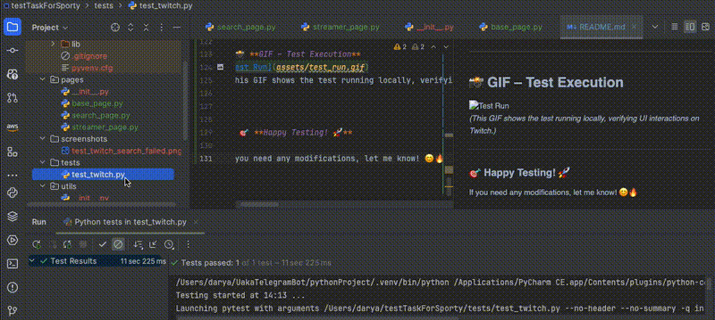

# **📌 Twitch Automated UI Test**
This project automates **Twitch mobile UI testing** using **Selenium, pytest, and Page Object Model (POM)**. The test searches for **"StarCraft II"**, selects a streamer, handles pop-ups, and takes a screenshot when the page fully loads. Many thanx to GPT and cats Kuzia 🐈‍⬛ and Bulka 😺 with supporting me during implementing this test task. This is my first python test automation experience!

---

## **📂 Project Structure**
```
📦 twitch_automation
 ┣ 📂 pages
 ┃ ┣ 📜 base_page.py        # Base class with common Selenium methods
 ┃ ┣ 📜 search_page.py      # Search results interactions
 ┃ ┣ 📜 streamer_page.py    # Streamer profile page interactions
 ┣ 📂 tests
 ┃ ┣ 📜 test_twitch.py      # Main test script
 ┣ 📂 utils
 ┃ ┣ 📜 browser_setup.py    # Browser setup, failure handling, screenshots
 ┃ ┣ 📜 logger.py           # Logging configuration
 ┣ 📂 screenshots           # Stores test screenshots
 ┣ 📜 requirements.txt      # Dependencies
 ┣ 📜 test_log.log          # Execution log file
 ┣ 📜 README.md             # Project documentation
```

---

## **🛠️ Technologies Used**
- **Python 3.x**
- **Selenium WebDriver** (for browser automation)
- **pytest** (for test execution)
- **WebDriver Manager** (to auto-install the correct ChromeDriver)
- **Logging & Screenshots** (for debugging failed tests)
- **Page Object Model (POM)** (for maintainability)

---

## **🚀 Test Scenario**
1. **Open Twitch Mobile with the search endpoint "StarCraft II"** 
2. **Handle the Cookie Notice** (if it appears).
3. **Scroll down twice**.
4. **Open the first streamer link**.
5. **Handle pop-ups** (if any).
6. **Wait until the page fully loads**.
7. **Take a screenshot**.
8. **If the test fails, automatically capture a failure screenshot**.

---

## **⚙️ Setup & Installation**
### **1️⃣ Install Dependencies**
Ensure you have Python installed, then run:
```sh
pip install -r requirements.txt
```
_(If you don’t have `requirements.txt`, install manually with: `pip install selenium pytest webdriver-manager`)_  

### **2️⃣ Run the Test**
Run all tests using pytest:
```sh
pytest tests/test_twitch.py --capture=no --log-cli-level=INFO
```
Run a specific test:
```sh
pytest -k "test_twitch_search"
```

---

## **📸 Screenshots on Test Success/Failure**
| Type | Location |
|------|---------|
| ✅ **Success Screenshot** | `screenshots/twitch_test_success.png` |
| ❌ **Failure Screenshot** | `screenshots/test_twitch_search_failed.png` |

If a test **fails**, a screenshot is automatically saved in the **`screenshots/`** folder.

---

## **📝 Logging**
Test execution logs are saved in **`test_log.log`**, which records:  
✅ **Start & End of the Test**  
✅ **Actions Performed** (like clicking elements, searching, etc.)  
✅ **Errors & Debugging Information**  
✅ **Screenshot Paths for Failures**  

**Example Log Output:**
```
2025-03-18 12:00:00 - INFO - 🚀 Starting browser...
2025-03-18 12:00:05 - INFO - 🔍 Opening Twitch home page...
2025-03-18 12:00:07 - INFO - ✅ Cookie notice is visible, closing it...
2025-03-18 12:00:09 - INFO - 🔎 Searching for 'StarCraft II'...
2025-03-18 12:00:12 - INFO - 📜 Scrolling and selecting a streamer...
2025-03-18 12:00:15 - ERROR - ❌ Test failed! Screenshot saved: screenshots/test_twitch_search_failed.png
2025-03-18 12:00:19 - INFO - 🛑 Browser closed.
```

---

## **📌 Key Features & Improvements**
| Feature | Benefit |
|---------|---------|
| ✅ **Page Object Model (POM)** | Code is modular, reusable, and easy to maintain |
| ✅ **Logging** | Detailed execution logs help debug test failures |
| ✅ **Failure Handling** | Screenshots are automatically taken on test failures |
| ✅ **Visibility Checks** | Prevents crashes by checking if elements are visible before interacting |
| ✅ **WebDriver Manager** | Automatically downloads the correct ChromeDriver version |
| ✅ **Mobile Emulation** | Runs tests in a simulated mobile browser |

---

## **📩 Submission Steps**
1. Upload the project to **GitHub**.  
2. Ensure the **GIF** (`test_run.gif`) is included in `assets/`.  
3. Send the **GitHub repository link** to the recruiter.  

---

## 📸 **GIF – Test Execution**
  
_(This GIF shows the test running locally, verifying UI interactions on Twitch.)_
!

---

### 🎯 **Happy Testing! 🚀**  

If you need any modifications, let me know! 😊🔥